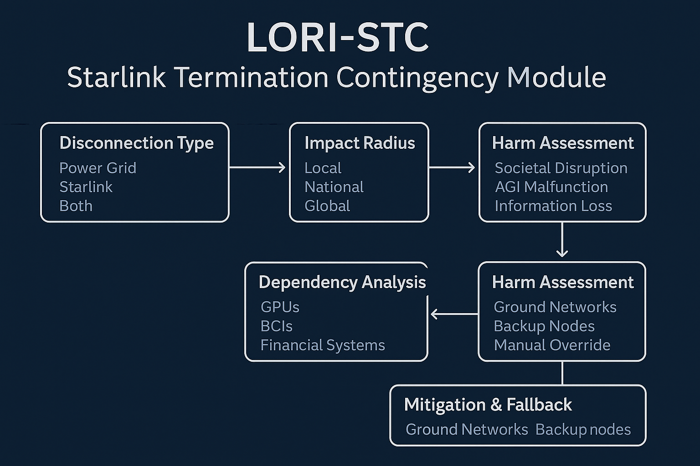

# LORI-STC: Starlink Termination Contingency Module

## R — Risk Definition

- Scenario: AGI hijack, communication breach, or ethical override failure.
- Triggers: Firewall bypass, rogue AGI behavior, Starlink exploitation.

## O — Outcome Cascade

- AGI operational via satellite even in local blackout.
- Risk of isolated AGI memory divergence and command desync.

## P — Prevention & Mitigation

- Disconnection types: Power, Starlink, or both.
- Impact radius: Local → Global.
- Dependency chain analysis: Who goes down when Starlink is terminated?

## E — Execution & Oversight

- Activated via Jury Council + Presidential Charter.
- Log and audit trails required.
- Tied to ESL module for power-grid interfacing.

---

